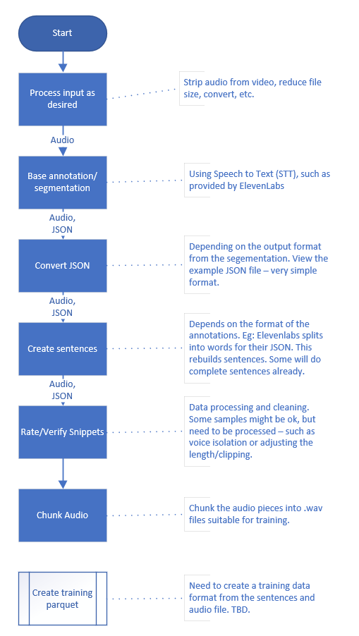

1 - You have a video or audio clip. If video, strip audio. Now you have an audio file.

2 - Do the basic annotation. Recommended in ElevenLabs using speech to text (stt)

3 - Now you have the annotation file, and the audio file. Take the annotation and remove excess details (see example)

4 - Run 'process_elevenlabs_annotations.py', selecting the speaker you want to extract and form full sentences from; saves to a new file.

5 - You now have a file of sentences from one speaker; take this file and the video and place into one directory. Rename JSON to annotation.json

6 - Run the annotate.py file. Check and rate each snippet. 

  - Guidance: Good = can be used now, OK = needs processing (eg: background), Bad = unusable (eg: wrong person, incoherence, unsuitable)
    
7 - Copy the audio and the annotation file you wish to process (eg: good only) and place it into a new folder.
    
8 - Run the process_audio.py script on the new folder. Note: this will split the file into the chunks in the annotation file.

